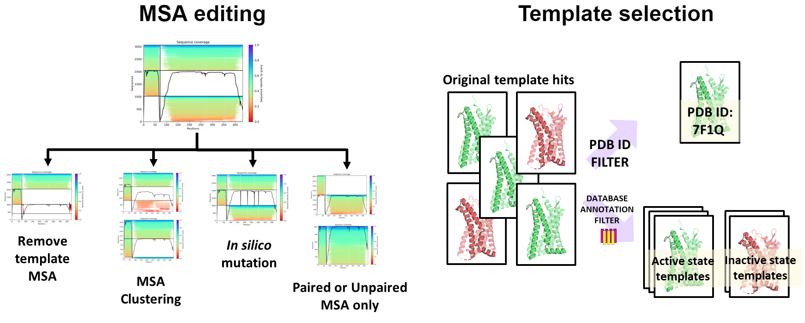

# LIT-AlphaFold



## Updates

The current version of LIT-AlphaFold presents some new features compared to the original v1.0.0 .

The two most relevant changes concern:
- Script input, moving from using FLAGS to using [Hydra](https://hydra.cc) to better handle the large number of parameters, and by giving easier access to specific set of parameters corresponding to specific methods.
- Input file, moving from the previous unstructured input format to a new format based on the [YAML](https://yaml.org/spec/1.2.2/) language.


The most relevant change from the previous version is the use of  to handle input and parameters, please read the project's [Wiki](https://github.com/LIT-CCM-lab/LIT-AlphaFold/wiki) to lern how the input format has changed.

## Description

LIT-AlphaFold is a modified version of AlphaFold developed in the [Laboratoire d'Innovation Thérapeutique](https://medchem.unistra.fr/)(LIT) at the University of Strasbourg.

LIT-AlphaFold combines features from [AlphaPulldown](https://github.com/KosinskiLab/AlphaPulldown) and [ColabFold](https://github.com/sokrypton/ColabFold), while including additional tools for multistate modelling.

Different tools for MSA editing (clustering, masking, mutation, subsampling), and template selection are avaialble. By using these tools it is possible to generate alternative conformations of protein and protein-protein complexes, compared to the default AlphaFold pipelines.

The pipeline is available for both local installation and online use on [Google Colab](https://colab.research.google.com/github/LIT-CCM-lab/LIT-AlphaFold/blob/main/LIT-AlphaFold-Colab.ipynb)

## Pre-installation

Before installing LIT-AlphaFold we advise to download AlphaFold's weights and the related genetic databases. To do so please follow the instructions in https://github.com/kalininalab/alphafold_non_docker.

LIT-AlphaFold **does not** require to download the genetic databases since it is configured to also use the *MMseqs2* webserver for MSA generation, as in ColabFold.

The models' weights **must** be downloaded since LIT-AlphaFold has been developed to run calculations locally.

## Installation

**conda** is required to install LIT-AlphaFold. If *conda* is not already installed on your machine, or you are unfamiliar with its use, a user guide can be found [here](https://docs.conda.io/projects/conda/en/latest/user-guide/getting-started.html).

1. Clone the LIT-AlphaFold repository and enter the directory.
```console
git clone https://github.com/LIT-CCM-lab/LIT-AlphaFold
cd LIT-AlphaFold
```

2. Create the conda environment from the *litaf_env.yaml* file.
```console
conda env create -f  litaf_env.yaml
conda activate lit-af
```
3. Install AlphaFold, ColabFold, and AlphaPulldown using pip. AlphaPulldown is installed without its dependencies to avoid conflicts with the different versions, some modules used for analysis might be missing, in case it is advised to install them manually via pip.
```console
pip install alphapulldown==0.40.4 --no-deps
pip install --no-warn-conflicts "colabfold[alphafold-minus-jax] @ git+https://github.com/sokrypton/ColabFold@v1.5.3"
pip install https://storage.googleapis.com/jax-releases/cuda11/jaxlib-0.3.25+cuda11.cudnn82-cp310-cp310-manylinux2014_x86_64.whl
pip install jax==0.3.25 chex==0.1.6 biopython==1.79
```
4. Install the *litaf* module
```console
pip install litaf/
```

5. Change the configuration file in the folder *conf* with the relevant information corresponding to your local installation of AlphaFold.

In the file *conf/features/config.yaml* it is necessary to indicate where the genetic and template database are stored. If all databases were downloaded in a single folder, it is only necessary to update the *data_dir* field, while the others can be kept to *null*, in other cases it is necessary to specify the location of each individual missing database from the main folder.

Additionally, during the installation of LIT-AlphaFold all the principal tools for database search were installed. In case you wish to use a different installation of the software in the pipeline please replace the corresponding field with its absolute path.
```
db:
  data_dir: /alpha/alphafold_data
  uniref30_database_path: null
  uniref90_database_path: null
  mgnify_database_path: null
  bfd_database_path: null
  small_bfd_database_path: null
  pdb_seqres_database_path: null
  template_mmcif_dir: null
  obsolete_pdbs_path: null
  pdb70_database_path: null
  custom_template_path: null
  use_small_bfd: False

soft:
  jackhmmer_binary_path: jackhmmer
  hhblits_binary_path: hhblits
  hhsearch_binary_path: hhsearch
  hmmsearch_binary_path: hmmsearch
  hmmbuild_binary_path: hmmbuild
  kalign_binary_path: kalign

```

In the file *conf/predict/config.yaml* set the *data_dir* field to the folder containing all of the models' weights used by AlphaFold and AlphaFold-Multimer.

```
weights:
  data_dir: /alpha/alphafold_data
  multimer_type: v3
  monomer_type: _ptm
```

## Apptainer

To facilitate the use of LIT-AlphaFold this repository includes an [Apptainer](https://apptainer.org/) definition file, which has been tested as compatible with the developed code.

To create the Apptainer image run the command below.

```console
apptainer build litaf.sif litaf.def
```

Afterwards you can use the container to run LIT-AlphaFold, without the need to setup the environement.

```console
apptainer run --nv LIT-AlphaFold_script.py
```

## How to use

LIT-AlphaFold splits the protein structure prediction pipeline of AlphaFold in two main step: information retrieval, and structure prediction.

During information retrieval genetic databases and a template database are queried to obtain information regarding the target proteins, after taking as input one or more FASTA files containing their sequences.
```console
python create_individual_features.py fasta_paths=[test.fasta]
```
Once protein information has been retrieved the structure of the protein can be predicted:
```console
python run_multimer_jobs.py input_file=[test.in.yaml] monomer_objects_dir=[folder_with_protein_features]
```
The input file is formed by the lists of proteins forming the multimers to be predicted.
```
----
- protein_1 #Protein predicted as a monomer
----
- unit_1 #Protein predicted as a multimer formed by unit_1 and unit_2
- unit_2
```

LIT-AlphaFold gives you control over the input information used for structure prediction.
More information about the available tools and how to use them are available in the project's [Wiki](https://github.com/LIT-CCM-lab/LIT-AlphaFold/wiki).

Google Colab implementation of the tutorials are also available:
* [Monomer and Multistate predictions (Tutorial 1-4)](https://colab.research.google.com/github/LIT-CCM-lab/LIT-AlphaFold/blob/main/LIT-AlphaFold-Colab_Tutorial_Monomer.ipynb)
* Homo-oligomer prediction (Tutorial 5)  **Coming soon**
* Multimer prediction (Tutorial 5) **Coming soon**

## How to reference this work ?
If you are using **LIT-AlphaFold** please cite:
- Urvas L, Chiesa L, Bret G, Jaquemard C, and Kellenberger E.  <br />
  *Benchmarking AlphaFold-generated structures of chemokine – chemokine receptor complexes.* <br />
  Journal of Chemical Information and Modeling (**2024**) doi: [10.1021/acs.jcim.3c01835](https://pubs.acs.org/doi/10.1021/acs.jcim.3c01835)
- Mirdita M, Schütze K, Moriwaki Y, Heo L, Ovchinnikov S, and Steinegger M. <br />
  *ColabFold: Making protein folding accessible to all.* <br />
  Nature Methods (**2022**) doi: [10.1038/s41592-022-01488-1](https://www.nature.com/articles/s41592-022-01488-1)
- Yu D, Chojnowski G, Rosenthal M, and Kosinski J.  <br />
  *AlphaPulldown—a python package for protein–protein interaction screens using AlphaFold-Multimer.* <br />
  Bioinformatics (**2023**) doi: [10.1093/bioinformatics/btac749](https://academic.oup.com/bioinformatics/article/39/1/btac749/6839971)

If you’re using **AlphaFold**, please also cite: <br />
- Jumper et al. <br />
  *Highly accurate protein structure prediction with AlphaFold.* <br />
  Nature (**2021**) doi: [10.1038/s41586-021-03819-2](https://doi.org/10.1038/s41586-021-03819-2)
  
If you’re using **AlphaFold-multimer**, please also cite: <br />
- Evans et al.<br />
  *Protein complex prediction with AlphaFold-Multimer.* <br />
  biorxiv (**2021**) doi: [10.1101/2021.10.04.463034v1](https://www.biorxiv.org/content/10.1101/2021.10.04.463034v1)

If you are using **MMseqs2**, please also use the appropriate citation in: [MMseqs2](https://github.com/soedinglab/MMseqs2)

To cite specific methods from multistate structure prediction please use the reference in the appropriate tutorial or check the log file generated by *run_multimer_jobs.py*.

## Roadmap
Future releases might include:
* User defined MSA for monomers
* User defined MSA for multimers